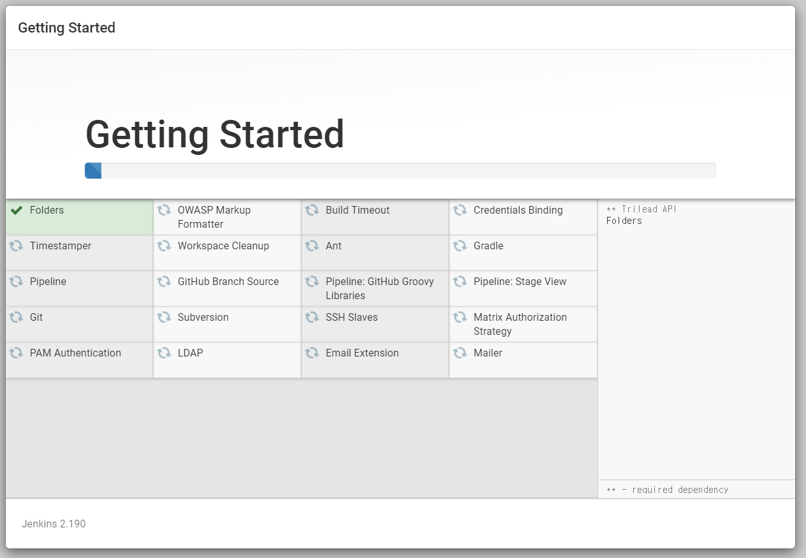

이번 포스트는 Jenkins를 이용해서 배포를 자동화하는 방법을 적어보려고 한다.

Jenkins는 Github와 연동하여 push가 일어났을 때 특정 커맨드를 서버에 실행시켜서 자동으로 변경된 부분을 받아오고 빌드시키고 배포하는 작업까지 도와준다.

내가 사용하고 있는 서버는 Node.js 서버이기 때문에 Node.js 서버 기준으로 작성되는 점 참고바란다.

내가 Jenkins 사용 전 기존에 배포하는 방법은 다음과 같았다.

1. 배포중이던 폴더 백업
2. Win SCP를 이용한 프로젝트 파일 삭제 후 드래그인 드롭으로 파일 업데이트
3. 명령어를 이용한 빌드 후 배포

위 방식은 매우 수동적인 배포 방법이다.

서버 배포에 대한 지식이 얕았던 나는 이 방식이 최선인 줄만 알고 지금까지 계속 사용해왔는데 이 배포 방식에 문제가 없다고 느낀 나 스스로가 반성 중이다.

그래서 나는 Jenkins를 이용하여 다음과 같은 방식으로 배포를 자동화하기로 하였다.

1. develop 브랜치 혹은 브랜치 전략에 맞게 개발 후 master 브랜치로 merge
2. master 브랜치에서 코드 충돌 여부 확인 후 git push
3. git push 발생 시 jenkins 서버에서 작성해놓은 스크립트를 통해 빌드 및 배포

## Jenkins 설치

Jenkins를 사용하려면 먼저 Java가 깔려있어야한다.

```bash
sudo apt-get update
sudo apt-get upgrade //분홍색 안내시 NO, 설정 변경시 n
sudo apt install default-jre # 자바 설치
java -version # 자바 버전 확인

openjdk version "11.0.5" 2019-10-15
OpenJDK Runtime Environment (build 11.0.5+10-post-Ubuntu-0ubuntu1.118.04)
OpenJDK 64-Bit Server VM (build 11.0.5+10-post-Ubuntu-0ubuntu1.118.04, mixed mode, sharing)
```

자바를 다 설치했다면 이제 Jenkins를 설치한다.

```bash
wget -q -O - https://pkg.jenkins.io/debian/jenkins-ci.org.key | sudo apt-key add -
sudo sh -c 'echo deb http://pkg.jenkins-ci.org/debian binary/ > /etc/apt/sources.list.d/jenkins.list'
sudo apt-get update
sudo apt-get install jenkins

sudo service jenkins restart
sudo systemctl status jenkins # 젠킨스 서버 상태 확인
```

만약 jenkins 서버의 port를 변경하고 싶다면

```bash
sudo vi /etc/default/jenkins

# HTTP_PORT=8080 부분을 원하는 포트로 변경 후 저장해주면 된다.
```

그 다음 Jenkins 서버를 시작했다면 `http://{서버 IP 주소}:{jenkins 서버 Port}`를 입력하고 사이트에 들어간다. 처음 접속 시에는 admin password를 입력해야하기 때문에


```bash
sudo cat /var/lib/jenkins/secrets/initialAdminPassword
```

후에 표시된 값을 복붙하여 로그인한다.




왼쪽 추천 플러그인 설치를 누른 후 설치 완료까지 대기한다.


그 다음 관리자 계정을 생성한다.


jenkins URL을 입력한 후 Save and Finish를 누른다. 여기는 나중에 설정에서 수정할 수 있으므로 Not now를 눌러 건너뛸 수도 있다.

여기까지 Jenkins 설치는 끝났다. 이제 Github와 연동하여 프로젝트를 생성해보자.

## Jekins에 Github 프로젝트 생성

---

젠킨스 메인 화면에서 `New Item` 메뉴를 선택하고, `Freestyle Project` 를 선택한 다음 아이템 명을 입력한다. 나는 github project와 이름을 동일하게 지어주었다.


그 다음 Github project를 체크하고 프로젝트 URL을 넣는다.

`https://github.com/유저네임/프로젝트명` 이다.


그 다음 소스 코드 관리 탭에서 `Git` 을 선택하고 Repository URL에는 clonse에 쓰이는 URL을 넣는다.

`https://github.com/유저네임/프로젝트명.git` 이다.


그리고 Credentials에는 Add를 눌러서 username에는 계정 이메일이 아닌, 닉네임을 넣어주고 password에는 비밀번호를 누르고 ID는 구분만 하면 되기 때문에 대충 넣어준다.


그리고 저장을 해준다.

여기서 ID/PWD가 아닌 SSH를 이용한 인증 방법도 있는데, 나는 우선 ID/PWD 인증 방식으로 사용해보겠다.

## Webhook 설정

---

배포 순서에 말했듯이 git push가 일어나면 빌드가 되도록 하겠다는 설정을 바로 webhook을 이용하여 설정한다.

github에 push가 발생하면 jenkins에 알리기 위해 webhook을 설정하는 것이다.

Webhook이란 web callback 혹은 http push api라고도 불리며 앱이 다른 앱에 실시간 정보를 제공하는 방법이다. 웹훅은 실시간으로 데이터를 가져오기 위해 꽤 자주 polling 해야하는 전형적인 API와는 달리 다른 앱에 데이터를 즉시 전달하므로 데이터를 즉시 얻을 수 있다.

webhook의 단점은 처음에 웹훅을 설정하는 데에 어려움을 느낀다는 것이다. webhook은 API 스펙에 해당되기 때문에 `역방향 API`라고도 불리고 웹훅을 사용하기 위해선 API를 설계해야 되는 것이다. webhook은 http 요청으로 우리 앱에 post 요청을 보내온다.

그럼 Jenkins에서 webhook을 설정해보자.

1. Jenkins 관리로 가서 시스템 설정에서 Jenkins URL을 외부에서 접근이 가능하도록 수정한다. 나는 이미 외부에서 접속이 가능한 URL이기 때문에 패스한다.
2. github 프로젝트 설정에서 webhook 메뉴로 이동 후 add webhook을 누른다.
3. payload URL에 `{jenkins 주소}/github-webhook/`을 입력한다.
   ※ 마지막에 /를 빼먹으면 절대 안된다.
4. 나머지는 기본값으로 두고 add webhook을 누른다.
5. 다시 Jenkins로 돌아와 빌드 유발 탭에서 `Github hook trigger for GITScm polling` 을 선택한다.
6. 끝

참고로 jenkins 유저로 로그인한 상태에서 발생되는 명령어이기 때문에 이 점을 유의해야한다.

## Build

---

마지막으로 build 탭에서는 서버에 전달할 스크립트를 작성한다.

보통 git에서 변경된 내역을 반영하는 작업과 build, 그리고 배포까지 이 부분에 작성하면 git push 시에 작성한 script가 실행된다.

## 참조

---

[ubuntu 18.04 Jenkins Install](https://newtoynt.tistory.com/entry/ubuntu-1804-Jenkins-Install)

[우분투 18.04 젠킨스 설치](https://softwaree.tistory.com/61)

[[Jenkins] Github 프로젝트 연동, webhook, 자동배포 (3)](https://kutar37.tistory.com/entry/Jenkins-Github-%EC%97%B0%EB%8F%99-%EC%9E%90%EB%8F%99%EB%B0%B0%ED%8F%AC-3)
